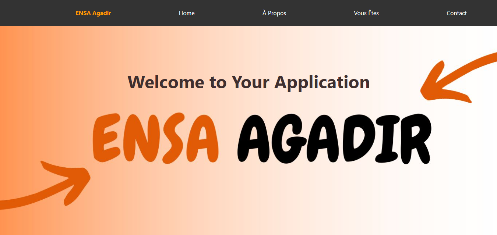
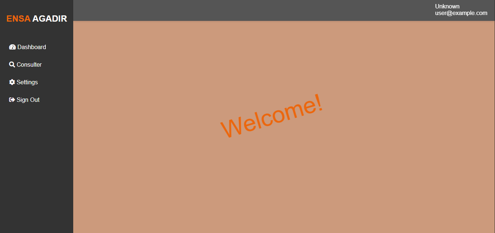
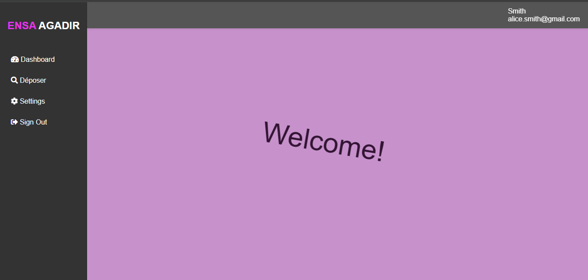
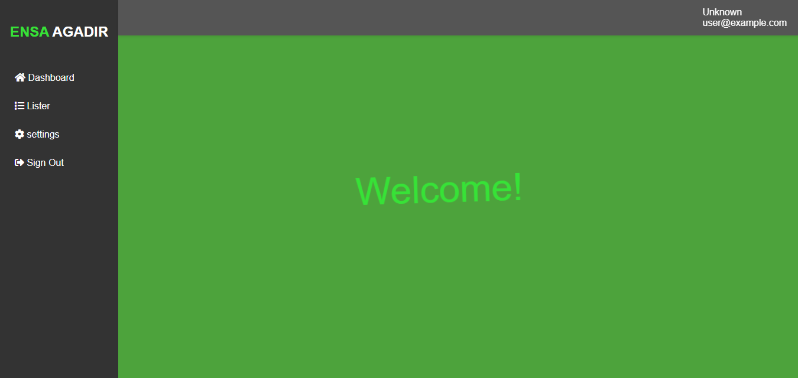
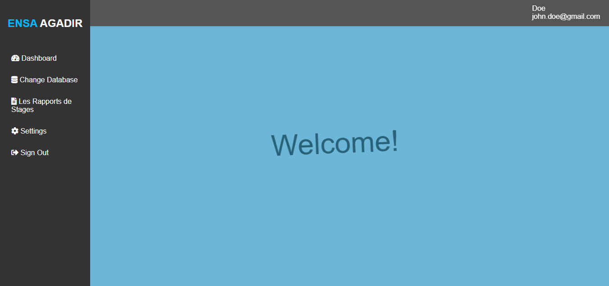
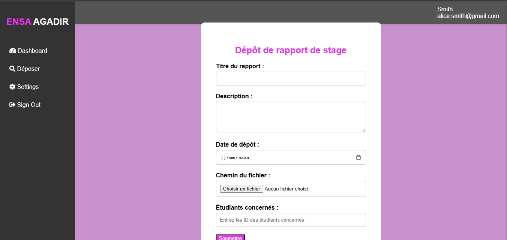
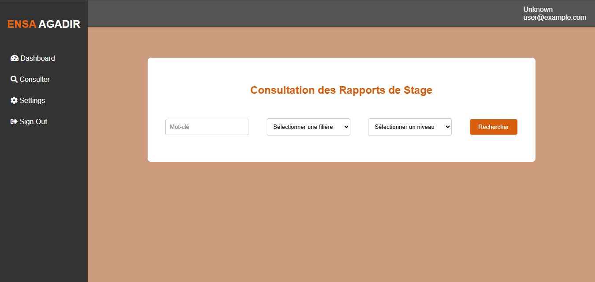

# 📚 Digital Internship Report Management Application

<br/>

## 🌍 About the Project

This web application aims to **digitize the management of internship reports** within  ENSA Agadir University.  
It provides an intuitive platform that allows **students** to view and download reports, and **teachers or administrators** to upload, edit, or delete them securely.

🎯 The main goal is to **simplify access, management, and archiving** of internship reports while **reducing the administrative workload** associated with manual handling.

<br/>

## 🧩 Main Features

### 👨‍🎓 For Students

- 🔍 Search internship reports by **department**, **year**, or **keyword**.  
- 📄 View a list of available reports.  
- 📥 Download reports in **PDF format**.  
- 🧾 Access an **advanced search form**.  

### 👩‍🏫 For Administrators / Teachers

- 🔐 Secure authentication with **role management** (admin, teacher, etc.).  
- 📤 Upload internship reports with details such as **title**, **description**, **date**, **department**, and **student name**.  
- ✏️ Edit existing reports.  
- 🗑️ Delete reports.  
- 🖨️ Print reports filtered by **department** or **year**.

  <br/>

## 📸 Application Preview

  ### landing page

  <p align="center">
  
  </p>
  
  ### Main Dashboard

  #### Student

  <p align="center">
  
  </p>
  
  #### Department Head

  <p align="center">
  
  </p>
  
  #### Secretary

  <p align="center">
  
  </p>
  
  #### Administrator

  <p align="center">
  
  </p>

## Report Upload

   <p align="center">
  
   </p>

## Report Consultation

   <p align="center">
  
   </p>

   ## Report Management
  
   <p align="center">
   
   </p>

   <br/>
   
## 🛠️ Technologies Used

- **Frontend:** HTML, CSS, JavaScript   
- **Backend:** PHP 
- **Database:** MySQL  
- **Web Server:** Apache 
- **Tools:** WAMP

  <br/>
  
## ⚙️ Installation & Setup

### 1️⃣ Clone the repository
```bash
git clone https://github.com/zinaakhtat/DigitalInternshipReportManagementApplication.git
cd DigitalInternshipReportManagementApplication.
```

## 2️⃣ Set up the database

- Create a MySQL database  
- Import the provided SQL file located in **`/database/database (3).sql`**

## 4️⃣ Run the application locally

- Start **Apache** and **MySQL** from **WAMP/XAMPP**  
- Open the app in your browser:  
  👉 http://localhost/DigitalInternshipReportManagementApplication/main_page.php

  <br/>

## 🤝 Contributing

1. **Fork** the repository

2. **Create a new branch** for your feature

```bash
git checkout -b feature/AmazingFeature
```

3. **Commit** your changes

```bash
git commit -m "Add AmazingFeature"
```

4. **Push** to the branch

```bash
git commit -m "Add AmazingFeature"
```

5. **Open** a Pull Request

<br/>

## 📄 Licence

This project is licensed under the MIT License.
See the LICENSE file for more details.

<br/>


